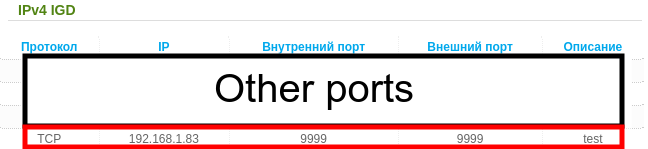

## Installation

```bash
go get -u github.com/DeNetPRO/turbo-upnp
```

## Usage
```golang
//initializes internet gateway device
device := fastupnp.InitDevice()

// forward port
description := "test"
port := 9999
device.Forward(port, description)
```


```golang
// close port 
device.Close(port)

// get your public ip 
ip := device.PublicIP()
```